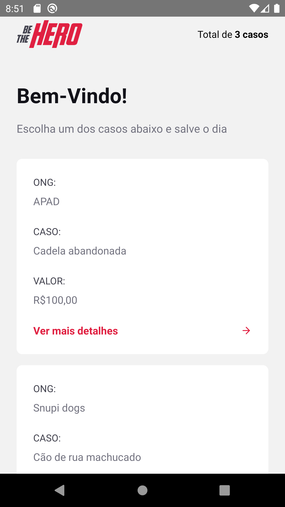

# Ecoleta
> Sistema composto de backend, aplicação web e mobile desenvolvida durante a Semana OmniSatck 11.

Sistema desenvolvido durante a Semana OmniSatck 11, composto por Backend (NodeJS - ExpressJS), aplicação SPA web (ReactJS) e aplicação mobile (React-Native).
O objetivo desse sistema é facilitar a comunicação entre ONGs e pessoas interessadas em ajudar em algum caso que a ONG esteja trabalhando.
O cadastro das ONGs é feito através da aplicação web, onde a ONG tamém poderá criar e remover os casos; através do aplicativo o usuário pode visualizar uma lista de casos os quais as ONGs cadastradas estão trabalhando, podendo entrar em contato por email ou Whatsapp.




Para mais screenshots acesse a pasta "screenshots" desse repositório.

## Instalação

Este aplicativo não possui nenhum deploy, caso desejar contribuir para o desenvolvimento siga para a próxima seção.

## Configuração para Desenvolvimento

Para fazer a instalação das dependências, baixe os arquivos que compõe o projeto. Será necessário ter o NodeJS instalado na sua máquina. No terminal, acesse a pasta em que os arquivos estão e digite o seguinte código:

```sh
npm install
```

Será feito a instalação de todas as dependências do projeto

## Histórico de lançamentos

* 0.0.1
    * Versão da Next Level Week com adição de campos de seleção das UFs e cidades no aplicativo mobile.

## Meta

Rockseat - https://github.com/Rocketseat

Rilton Moreira – rilton_moreira@hotmail.com


## Contributing

1. Faça o _fork_ do projeto (<https://github.com/RiltonSM/Mobile-Mines/fork>)
2. Crie uma _branch_ para sua modificação (`git checkout -b feature/fooBar`)
3. Faça o _commit_ (`git commit -am 'Add some fooBar'`)
4. _Push_ (`git push origin feature/fooBar`)
5. Crie um novo _Pull Request_

